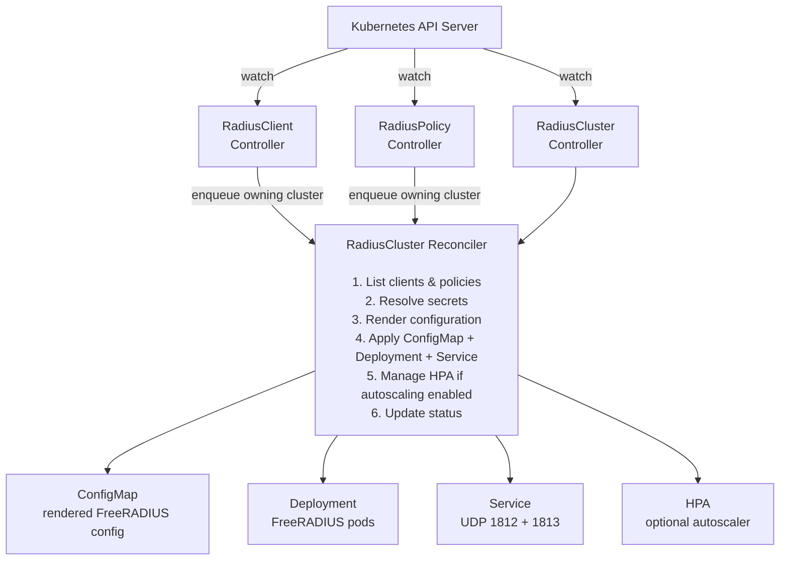

# Architecture

How the operator turns custom resources into a running FreeRADIUS deployment.

---

## High-Level Overview

The operator follows the standard Kubernetes [controller pattern](https://kubernetes.io/docs/concepts/architecture/controller/). Three controllers watch their respective custom resources and coordinate to produce a fully configured FreeRADIUS deployment.



## Controllers

### RadiusCluster Controller

The primary controller. It owns and manages all downstream Kubernetes resources for a given `RadiusCluster`.

**Watches**: `RadiusCluster`
**Owns**: `Deployment`, `Service`, `ConfigMap`, `HorizontalPodAutoscaler`

The reconciliation loop:

1. Fetch the `RadiusCluster` resource
2. Set `Progressing=True`
3. List all `RadiusClient` and `RadiusPolicy` resources whose `clusterRef` matches
4. Resolve every referenced `Secret` — if any are missing, set `Degraded=True` and requeue after 30 seconds
5. Call the **ConfigRenderer** with the cluster spec, clients, policies, and resolved secrets
6. `CreateOrUpdate` the ConfigMap with rendered config files
7. `CreateOrUpdate` the Deployment with the generated pod spec
8. `CreateOrUpdate` the Service
9. Create, update, or delete the HPA based on `spec.autoscaling.enabled`
10. Update status fields: `readyReplicas`, `currentImage`, `podRestarts`
11. Set final conditions: `Available=True`, `Progressing=False`, `Degraded=False`

### RadiusClient Controller

A lightweight controller that validates `RadiusClient` resources and triggers reconciliation of the owning cluster.

**Watches**: `RadiusClient`
**Updates**: `RadiusClient` status conditions (`Ready`, `Invalid`)
**Enqueues**: The `RadiusCluster` named in `spec.clusterRef`

### RadiusPolicy Controller

Validates `RadiusPolicy` resources (stage enum, action types) and triggers reconciliation of the owning cluster.

**Watches**: `RadiusPolicy`
**Updates**: `RadiusPolicy` status conditions (`Ready`, `Invalid`)
**Enqueues**: The `RadiusCluster` named in `spec.clusterRef`

## Config Renderer

The ConfigRenderer is a **pure function** — given the same inputs, it always produces identical output. This property makes it straightforward to test and reason about.

**Inputs**:
- `RadiusCluster` spec
- List of `RadiusClient` specs
- List of `RadiusPolicy` specs
- Resolved secret values (for rendering file paths)

**Outputs** (flat map of filename to content):

| Output File | Source |
|:------------|:-------|
| `radiusd.conf` | Cluster spec (listen ports, thread pool, logging) |
| `clients.conf` | All RadiusClient specs for this cluster |
| `mods-enabled/<name>` | Each enabled module in `spec.modules[]` |
| `sites-enabled/default` | Virtual server with policy rules from RadiusPolicies |

### Template Pipeline

Configuration files are rendered using Go's `text/template` engine. Templates live in `internal/renderer/templates/`:

```
templates/
├── core/
│   ├── radiusd.conf.tmpl
│   └── clients.conf.tmpl
├── mods-enabled/
│   ├── sql.tmpl
│   ├── ldap.tmpl
│   ├── eap.tmpl
│   ├── rest.tmpl
│   └── redis.tmpl
└── sites-enabled/
    └── default.tmpl
```

### Secret Handling

Secrets are **never** embedded as plaintext values in rendered configuration. Instead, the renderer produces file-path references:

```
# In clients.conf
client core-switch {
    ipaddr = 10.0.1.0/24
    secret = ${file:/etc/freeradius/secrets/switch-secret/shared-secret}
}
```

At runtime, the referenced Kubernetes Secret is mounted as a read-only volume at `/etc/freeradius/secrets/<secret-name>/`, and FreeRADIUS reads the value from disk.

## Status Reporter

The StatusReporter writes structured conditions to the status subresource of each CRD. Using the status subresource avoids update conflicts with spec changes.

### RadiusCluster Conditions

| Condition | Meaning |
|:----------|:--------|
| `Available` | All resources reconciled successfully; pods are serving traffic |
| `Progressing` | Reconciliation is underway |
| `Degraded` | A referenced Secret is missing or another recoverable error occurred |

### RadiusClient / RadiusPolicy Conditions

| Condition | Meaning |
|:----------|:--------|
| `Ready` | Resource is valid and the referenced cluster exists |
| `Invalid` | Validation failed (bad IP format, unknown stage, missing clusterRef) |

## Pod Spec

The operator generates a Deployment with the following pod structure:

```
Pod
├── Init Container (busybox)
│   └── Reconstructs directory tree from flat ConfigMap keys
│       (e.g., mods-enabled__sql → mods-enabled/sql)
│
├── Main Container (FreeRADIUS)
│   ├── Ports: 1812/UDP (auth), 1813/UDP (acct)
│   ├── Volume Mounts:
│   │   ├── /etc/freeradius/        ← rendered config (from ConfigMap)
│   │   └── /etc/freeradius/secrets/ ← one subdir per Secret
│   ├── Readiness Probe: exec status check on port 1812
│   └── Liveness Probe: exec radiusd -C (config syntax check)
│
└── Volumes
    ├── ConfigMap volume (rendered config files)
    ├── Secret volumes (one per referenced Secret, read-only)
    └── EmptyDir (scratch space for init container)
```

### Update Strategy

Deployments use a **RollingUpdate** strategy:
- `maxUnavailable: 0` — never remove a healthy pod before a new one is ready
- `maxSurge: 1` — create one extra pod during the rollout

This guarantees at least one pod is always serving RADIUS traffic during updates.

## Metrics

The operator exposes Prometheus metrics on `:8080/metrics`:

| Metric | Type | Labels | Description |
|:-------|:-----|:-------|:------------|
| `freeradius_operator_reconcile_total` | Counter | namespace, name, kind, result | Total reconciliation attempts |
| `freeradius_operator_reconcile_duration_seconds` | Histogram | — | Time spent in reconciliation |

## RBAC

The operator requires a `ClusterRole` with the following permissions:

| Resource | Verbs |
|:---------|:------|
| radiusclusters, radiusclients, radiuspolicies | get, list, watch, create, update, patch, delete |
| radiusclusters/status, radiusclients/status, radiuspolicies/status | get, update, patch |
| deployments, services, configmaps, horizontalpodautoscalers | get, list, watch, create, update, patch, delete |
| secrets, pods | get, list, watch |
| events | create, patch |

The full RBAC manifests are in `config/rbac/`.

## Design Properties

The operator is built around several correctness properties that are verified through property-based testing:

1. **Deterministic rendering** — The same inputs always produce the same configuration output
2. **Secret isolation** — Plaintext secret values never appear in ConfigMaps or logs
3. **Owner reference integrity** — All managed resources have correct owner references for garbage collection
4. **Idempotent reconciliation** — Running reconciliation twice with the same inputs produces no additional changes
5. **Graceful degradation** — Missing secrets cause `Degraded` status, not crashes or partial configuration
