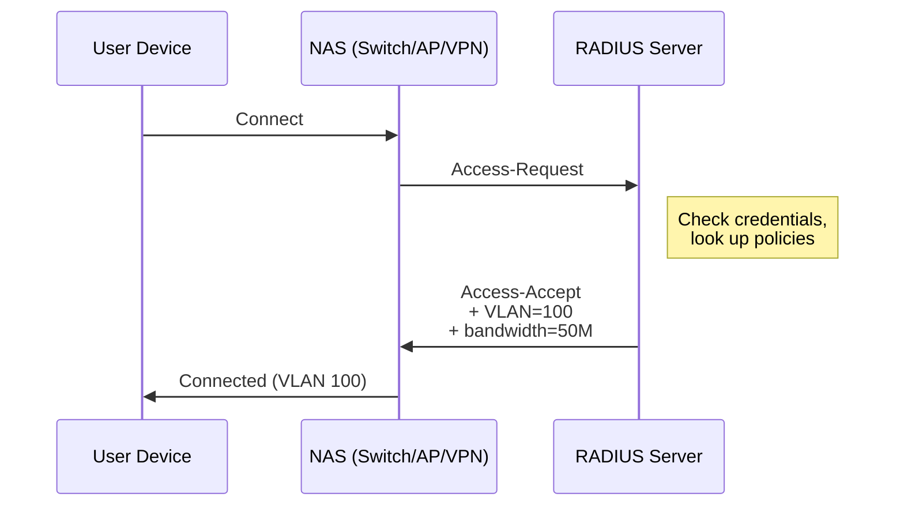
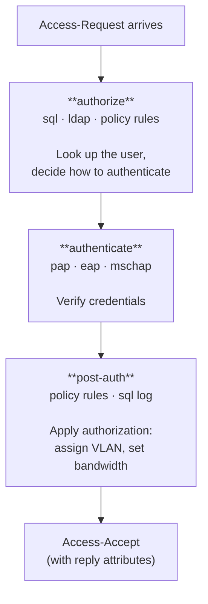
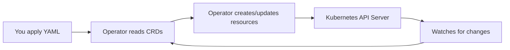

# Concepts
{: .no_toc }

RADIUS fundamentals for Kubernetes engineers — and Kubernetes fundamentals for network engineers.
{: .fs-6 .fw-300 }

## Table of contents
{: .no_toc .text-delta }

1. TOC
{:toc}

---

## What Is RADIUS?

**RADIUS** (Remote Authentication Dial-In User Service) is a networking protocol that provides centralized authentication, authorization, and accounting (AAA) for devices connecting to a network.

When a user plugs into a switch port, joins a WiFi network, or connects to a VPN, the network device (called a **NAS** — Network Access Server) doesn't decide on its own whether to allow access. Instead, it asks a RADIUS server.

### The AAA Model

| Function | What It Does | RADIUS Equivalent |
|:---------|:-------------|:------------------|
| **Authentication** | "Who are you?" | Access-Request / Access-Accept / Access-Reject |
| **Authorization** | "What are you allowed to do?" | Reply attributes (VLAN, bandwidth, ACL) |
| **Accounting** | "What did you do?" | Accounting-Request (Start/Stop/Interim) |

### Key Terminology

| Term | Meaning | Kubernetes Analogy |
|:-----|:--------|:-------------------|
| **NAS** (Network Access Server) | The switch, AP, or VPN gateway that sends RADIUS requests | Like a client pod calling an API |
| **Shared secret** | A password shared between the NAS and RADIUS server to authenticate and encrypt packets | Like a TLS client certificate or API key |
| **Attribute** | A key-value pair in a RADIUS packet (e.g., `User-Name`, `NAS-IP-Address`) | Like an HTTP header or request field |
| **Reply attribute** | An attribute sent back to the NAS that controls what happens to the user (e.g., VLAN assignment) | Like a response body |
| **Virtual server** | A FreeRADIUS processing pipeline with stages (authorize, authenticate, post-auth, etc.) | Like a middleware chain in an HTTP server |
| **Module** | A FreeRADIUS plugin that provides a specific capability (SQL lookup, LDAP bind, REST call) | Like a sidecar or backend service |
| **unlang** | FreeRADIUS's built-in policy language for writing `if/then` logic | Like Rego (OPA) or CEL for admission webhooks |

---

## How FreeRADIUS Processes a Request

FreeRADIUS processes each RADIUS packet through a series of **stages**. Each stage runs a list of modules and policy rules in order.

When you create a `RadiusPolicy`, you're inserting rules into one of these stages. The `priority` field controls where in the stage your rule runs.

---

## How the Operator Maps to FreeRADIUS

If you're used to configuring FreeRADIUS by hand, here's how the CRDs map to traditional config files:

| You Used To... | Now You... | CRD |
|:----------------|:-----------|:----|
| Edit `radiusd.conf` | Define a `RadiusCluster` with image, replicas, modules | `RadiusCluster` |
| Edit `clients.conf` | Create one `RadiusClient` per NAS device | `RadiusClient` |
| Edit `mods-enabled/*` | Add entries to `spec.modules[]` | `RadiusCluster` |
| Write unlang in `sites-enabled/default` | Create `RadiusPolicy` resources with match/action rules | `RadiusPolicy` |
| Manage shared secrets in flat files | Store them in Kubernetes Secrets, reference via `secretRef` | Kubernetes `Secret` |
| Run `radiusd -X` to debug | `kubectl logs` on the FreeRADIUS pod | — |
| Restart FreeRADIUS after config change | The operator does it automatically via rolling update | — |

---

## How the Operator Maps to Kubernetes

If you're a network engineer new to Kubernetes, here's a translation:

| RADIUS Concept | Kubernetes Resource | Created By |
|:---------------|:--------------------|:-----------|
| RADIUS server process | Pod (one or more containers running FreeRADIUS) | Operator |
| Server farm / pool | Deployment (manages a set of identical pods) | Operator |
| Load balancer VIP | Service (stable IP + DNS name pointing to pods) | Operator |
| Config files on disk | ConfigMap (key-value store mounted as files) | Operator |
| Passwords / keys | Secret (encrypted storage mounted as files) | You |
| "Scale up to 10 servers" | HorizontalPodAutoscaler (adjusts pod count based on CPU) | Operator |
| RADIUS server definition | `RadiusCluster` (your declarative spec) | You |
| `clients.conf` entry | `RadiusClient` (one per NAS device) | You |
| unlang policy block | `RadiusPolicy` (match conditions + actions) | You |

### The Reconciliation Loop

Kubernetes operators work on a **desired state** model. You declare what you want (CRD specs), and the operator continuously works to make reality match:

This means:
- Change a `RadiusClient` IP? The operator re-renders `clients.conf` and rolls out new pods.
- Delete a `RadiusPolicy`? The operator removes the rule from the config and updates the deployment.
- A pod crashes? Kubernetes restarts it. The operator updates status conditions.

You never SSH into a server or edit a file. You `kubectl apply` and the system converges.

---

## Ports and Protocols

| Port | Protocol | Purpose |
|:-----|:---------|:--------|
| 1812 | UDP | RADIUS Authentication |
| 1813 | UDP | RADIUS Accounting |
| 2083 | TCP | RadSec (RADIUS over TLS) |
| 8080 | TCP | Operator metrics (Prometheus) |

The operator creates a Kubernetes Service exposing ports 1812 and 1813 by default. When TLS is enabled, port 2083 is also available.

---

## Common RADIUS Attributes

These are the attributes you'll reference in `RadiusPolicy` match conditions and actions:

### Request Attributes (sent by the NAS)

| Attribute | Description | Example |
|:----------|:------------|:--------|
| `User-Name` | The username being authenticated | `jdoe@example.com` |
| `User-Password` | The user's password (PAP only) | — |
| `NAS-IP-Address` | IP address of the NAS device | `10.0.1.1` |
| `NAS-Port` | Physical port on the NAS | `GigabitEthernet0/1` |
| `Called-Station-Id` | MAC address of the AP (wireless) | `AA-BB-CC-DD-EE-FF` |
| `Calling-Station-Id` | MAC address of the client device | `11-22-33-44-55-66` |
| `Service-Type` | Type of service requested | `Framed-User` |
| `Acct-Status-Type` | Accounting event type | `Start`, `Stop`, `Interim-Update` |

### Reply Attributes (sent back to the NAS)

| Attribute | Description | Example |
|:----------|:------------|:--------|
| `Tunnel-Type` | Tunnel protocol (usually VLAN) | `VLAN` |
| `Tunnel-Medium-Type` | Tunnel medium | `IEEE-802` |
| `Tunnel-Private-Group-Id` | VLAN ID to assign | `100` |
| `Reply-Message` | Text message to display to the user | `Welcome, admin` |
| `Session-Timeout` | Maximum session duration (seconds) | `3600` |
| `Filter-Id` | Named ACL/filter to apply on the NAS | `PERMIT-ALL` |

---

## Further Reading

- [FreeRADIUS Documentation](https://freeradius.org/documentation/) — Upstream project docs
- [RFC 2865](https://datatracker.ietf.org/doc/html/rfc2865) — RADIUS Authentication protocol specification
- [RFC 2866](https://datatracker.ietf.org/doc/html/rfc2866) — RADIUS Accounting protocol specification
- [RFC 6614](https://datatracker.ietf.org/doc/html/rfc6614) — RadSec (RADIUS over TLS)
- [Kubernetes Operator Pattern](https://kubernetes.io/docs/concepts/extend-kubernetes/operator/) — How operators work
