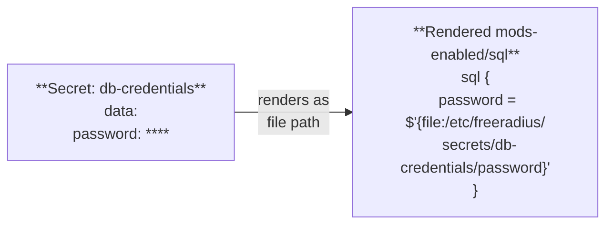

# Modules Guide

Configure backend modules for SQL, LDAP, EAP, REST, and Redis.

---

## Overview

FreeRADIUS modules are configured through the `modules[]` array in a `RadiusCluster` spec. Each module maps to a file in `mods-enabled/` in the rendered configuration.

```yaml
spec:
  modules:
    - name: my-sql-backend
      type: sql
      enabled: true
      sql:
        driver: postgresql
        server: db.internal
        port: 5432
        database: radius
        credentialsRef:
          name: db-creds
          key: password
```

You can define multiple modules of the same type (e.g., two SQL backends with different names) and reference them by name in `RadiusPolicy` actions.

---

## SQL Module

Connects FreeRADIUS to a relational database for user authentication, authorization, and accounting.

```yaml
- name: sql
  type: sql
  enabled: true
  sql:
    driver: postgresql
    server: db.internal
    port: 5432
    database: radius
    credentialsRef:
      name: db-credentials
      key: password
```

### SQL Fields

| Field | Type | Required | Description |
|:------|:-----|:---------|:------------|
| `driver` | string | yes | Database driver: `postgresql`, `mysql`, `sqlite` |
| `server` | string | yes | Database hostname or IP |
| `port` | int32 | yes | Database port |
| `database` | string | yes | Database name |
| `credentialsRef` | SecretRef | yes | Reference to database password Secret |

### Prerequisites

Create the database credentials Secret before applying the RadiusCluster:

```bash
kubectl create secret generic db-credentials \
  --namespace=radius \
  --from-literal=password='your-db-password'
```

---

## LDAP Module

Authenticates users against an LDAP or Active Directory server.

```yaml
- name: ldap
  type: ldap
  enabled: true
  ldap:
    server: ldap://ldap.internal
    port: 389
    baseDN: "dc=example,dc=com"
    identity: "cn=admin,dc=example,dc=com"
    credentialsRef:
      name: ldap-credentials
      key: password
```

### LDAP Fields

| Field | Type | Required | Description |
|:------|:-----|:---------|:------------|
| `server` | string | yes | LDAP URI (e.g., `ldap://` or `ldaps://`) |
| `port` | int32 | yes | LDAP port (389 or 636 for TLS) |
| `baseDN` | string | yes | Base distinguished name for searches |
| `identity` | string | yes | Bind DN for the service account |
| `credentialsRef` | SecretRef | yes | Reference to bind password Secret |

---

## EAP Module

Configures Extensible Authentication Protocol methods (PEAP, EAP-TLS, EAP-TTLS).

```yaml
- name: eap
  type: eap
  enabled: true
  eap:
    defaultMethod: peap
    tls:
      certRef:
        name: eap-tls-cert
        key: tls.crt
      keyRef:
        name: eap-tls-cert
        key: tls.key
```

### EAP Fields

| Field | Type | Required | Description |
|:------|:-----|:---------|:------------|
| `defaultMethod` | string | yes | Default EAP method: `peap`, `tls`, `ttls` |
| `tls.certRef` | SecretRef | yes | Reference to TLS certificate |
| `tls.keyRef` | SecretRef | yes | Reference to TLS private key |

---

## REST Module

Enables HTTP-based authentication by calling an external REST API.

```yaml
- name: rest
  type: rest
  enabled: true
  rest:
    server: https://auth-api.internal
    authEndpoint: /v1/radius/authorize
    acctEndpoint: /v1/radius/accounting
    credentialsRef:
      name: rest-api-token
      key: token
```

### REST Fields

| Field | Type | Required | Description |
|:------|:-----|:---------|:------------|
| `server` | string | yes | Base URL of the REST API |
| `authEndpoint` | string | no | Path for authorization requests |
| `acctEndpoint` | string | no | Path for accounting requests |
| `credentialsRef` | SecretRef | no | Reference to API token/credentials Secret |

---

## Redis Module

Uses Redis for session state, caching, or simultaneous-use enforcement.

```yaml
- name: redis
  type: redis
  enabled: true
  redis:
    server: redis.internal
    port: 6379
    credentialsRef:
      name: redis-credentials
      key: password
```

### Redis Fields

| Field | Type | Required | Description |
|:------|:-----|:---------|:------------|
| `server` | string | yes | Redis hostname or IP |
| `port` | int32 | yes | Redis port |
| `credentialsRef` | SecretRef | no | Reference to Redis password Secret (if AUTH is enabled) |

---

## Combining Multiple Modules

A production deployment might enable several modules simultaneously:

```yaml
spec:
  modules:
    - name: sql
      type: sql
      enabled: true
      sql:
        driver: postgresql
        server: db.internal
        port: 5432
        database: radius
        credentialsRef:
          name: db-credentials
          key: password
    - name: ldap
      type: ldap
      enabled: true
      ldap:
        server: ldaps://ad.corp.internal
        port: 636
        baseDN: "dc=corp,dc=internal"
        identity: "cn=radius-svc,ou=services,dc=corp,dc=internal"
        credentialsRef:
          name: ad-credentials
          key: password
    - name: eap
      type: eap
      enabled: true
      eap:
        defaultMethod: peap
        tls:
          certRef:
            name: radius-eap-cert
            key: tls.crt
          keyRef:
            name: radius-eap-cert
            key: tls.key
    - name: redis
      type: redis
      enabled: true
      redis:
        server: redis-cluster.internal
        port: 6379
```

Then reference these modules in policies:

```yaml
apiVersion: radius.operator.io/v1alpha1
kind: RadiusPolicy
metadata:
  name: sql-accounting
spec:
  clusterRef: production
  stage: accounting
  priority: 100
  actions:
    - type: call
      module: sql
```

## Secret Handling

All `credentialsRef` fields follow the same pattern:

1. You create a Kubernetes Secret with the credential value
2. You reference it in the module configuration via `SecretRef`
3. The operator mounts the Secret as a read-only volume
4. The rendered config references the file path — the plaintext value never appears in the ConfigMap


