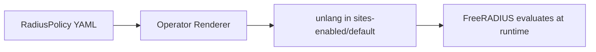

# Writing Policies

How RadiusPolicy CRD concepts map to FreeRADIUS unlang, with practical examples.

---

## How Policies Become Config

Each `RadiusPolicy` renders into an unlang block inside `sites-enabled/default`. The operator groups policies by `stage`, sorts by `priority` (ascending), and generates the unlang.



### CRD → unlang Mapping

| CRD Field | unlang Equivalent |
|:----------|:------------------|
| `stage: authorize` | Code placed inside `authorize { }` section |
| `priority: 100` | Position within the stage (lower = earlier) |
| `match.all` | Conditions joined with `&&` |
| `match.any` | Conditions joined with `\|\|` |
| `match.none` | Conditions negated with `!` |
| `actions[].type: set` | `update reply { Attr := "Value" }` |
| `actions[].type: call` | Bare module invocation (e.g., `sql`) |
| `actions[].type: reject` | `reject` |
| `actions[].type: accept` | `ok` |
| `actions[].type: redundant` | `redundant { mod1 mod2 }` |
| `actions[].type: load-balance` | `load-balance { mod1 mod2 }` |
| `rawConfig` | Literal unlang (replaces generated block) |

---

## Match Conditions

### AND — all conditions must be true

```yaml
match:
  all:
    - attribute: NAS-IP-Address
      operator: "=="
      value: "10.0.1.1"
    - attribute: User-Name
      operator: "=~"
      value: "^admin-"
```

Renders to:

```
if ((NAS-IP-Address == 10.0.1.1) && (User-Name =~ /^admin-/)) {
```

### OR — any condition must be true

```yaml
match:
  any:
    - attribute: User-Name
      operator: "=="
      value: "guest"
    - attribute: User-Name
      operator: "=~"
      value: "^visitor-"
```

Renders to:

```
if ((User-Name == guest) || (User-Name =~ /^visitor-/)) {
```

### NOT — none of the conditions may be true

```yaml
match:
  none:
    - attribute: Service-Type
      operator: "=="
      value: "Call-Check"
```

Renders to:

```
if (!(Service-Type == Call-Check)) {
```

### Combining AND + OR + NOT

When multiple match types are used together, they are combined with AND:

```yaml
match:
  all:
    - attribute: NAS-IP-Address
      operator: "=="
      value: "10.0.1.1"
  any:
    - attribute: User-Name
      operator: "=~"
      value: "^admin-"
    - attribute: User-Name
      operator: "=~"
      value: "^staff-"
  none:
    - attribute: Service-Type
      operator: "=="
      value: "Call-Check"
```

Renders to:

```
if ((NAS-IP-Address == 10.0.1.1) && ((User-Name =~ /^admin-/) || (User-Name =~ /^staff-/)) && !(Service-Type == Call-Check)) {
```

---

## Actions

### Setting reply attributes

The `set` action adds attributes to the RADIUS reply sent back to the NAS:

```yaml
actions:
  - type: set
    attribute: Tunnel-Type
    value: VLAN
  - type: set
    attribute: Tunnel-Private-Group-Id
    value: "100"
```

Renders to:

```
update reply {
    Tunnel-Type := "VLAN"
}
update reply {
    Tunnel-Private-Group-Id := "100"
}
```

### Calling modules

The `call` action invokes a FreeRADIUS module by name. The module must be defined in the RadiusCluster's `spec.modules[]`:

```yaml
actions:
  - type: call
    module: sql
```

Renders to:

```
sql
```

### Redundant failover

Try modules in order. Stop at the first one that succeeds:

```yaml
actions:
  - type: redundant
    modules:
      - sql-primary
      - sql-replica
```

Renders to:

```
redundant {
    sql-primary
    sql-replica
}
```

### Load balancing

Distribute requests across modules evenly:

```yaml
actions:
  - type: load-balance
    modules:
      - sql-shard1
      - sql-shard2
```

Renders to:

```
load-balance {
    sql-shard1
    sql-shard2
}
```

---

## Priority and Ordering

Policies within a stage are sorted by `priority` (ascending). Lower values run first.

```yaml
# Runs first (priority 10)
- name: check-blacklist
  stage: authorize
  priority: 10
  actions:
    - type: call
      module: sql

# Runs second (priority 100)
- name: assign-vlan
  stage: authorize
  priority: 100
  actions:
    - type: set
      attribute: Tunnel-Type
      value: VLAN
```

!!! tip
    Use gaps (10, 20, 30 or 100, 200, 300) so you can insert policies later without renumbering.

---

## Raw Config Escape Hatch

When the CRD's match/action model isn't enough, use `rawConfig` to write unlang directly. The `stage` and `priority` fields still control placement and ordering.

```yaml
spec:
  clusterRef: production
  stage: authorize
  priority: 5
  rawConfig: |
    if (&Calling-Station-Id && !&User-Password) {
        update control {
            Auth-Type := Accept
        }
        update reply {
            Tunnel-Type := VLAN
            Tunnel-Medium-Type := IEEE-802
            Tunnel-Private-Group-Id := "100"
        }
    }
```

Common use cases for `rawConfig`:

- MAC authentication bypass (no password, match on Calling-Station-Id)
- Updating `control` or `request` attributes (the `set` action only writes to `reply`)
- Complex nested if/else logic
- Module return code checks (`if (ok)`, `if (notfound)`)

!!! warning
    Raw config is not validated by the operator. Syntax errors will cause FreeRADIUS to fail to start.

---

## Complete Example

A policy set for a campus wireless deployment:

```yaml
# 1. Reject non-campus users (priority 10, runs first)
apiVersion: radius.operator.io/v1alpha1
kind: RadiusPolicy
metadata:
  name: reject-external
spec:
  clusterRef: campus-wifi
  stage: authorize
  priority: 10
  match:
    none:
      - attribute: User-Name
        operator: "=~"
        value: "@campus\\.edu$"
  actions:
    - type: reject
---
# 2. Look up user in LDAP with SQL fallback (priority 20)
apiVersion: radius.operator.io/v1alpha1
kind: RadiusPolicy
metadata:
  name: user-lookup
spec:
  clusterRef: campus-wifi
  stage: authorize
  priority: 20
  actions:
    - type: redundant
      modules:
        - ldap
        - sql
---
# 3. Assign staff VLAN (priority 100, runs after auth)
apiVersion: radius.operator.io/v1alpha1
kind: RadiusPolicy
metadata:
  name: staff-vlan
spec:
  clusterRef: campus-wifi
  stage: post-auth
  priority: 100
  match:
    all:
      - attribute: User-Name
        operator: "=~"
        value: "^staff-"
  actions:
    - type: set
      attribute: Tunnel-Type
      value: VLAN
    - type: set
      attribute: Tunnel-Private-Group-Id
      value: "100"
---
# 4. Record accounting to SQL (priority 10)
apiVersion: radius.operator.io/v1alpha1
kind: RadiusPolicy
metadata:
  name: accounting
spec:
  clusterRef: campus-wifi
  stage: accounting
  priority: 10
  actions:
    - type: call
      module: sql
```

This renders to:

```
server default {
    authorize {
        # priority 10: reject-external
        if (!(User-Name =~ /@campus\.edu$/)) {
            reject
        }
        # priority 20: user-lookup
        if (true) {
            redundant {
                ldap
                sql
            }
        }
    }
    authenticate {
    }
    preacct {
    }
    accounting {
        # priority 10: accounting
        if (true) {
            sql
        }
    }
    post-auth {
        # priority 100: staff-vlan
        if ((User-Name =~ /^staff-/)) {
            update reply {
                Tunnel-Type := "VLAN"
            }
            update reply {
                Tunnel-Private-Group-Id := "100"
            }
        }
    }
    ...
}
```
