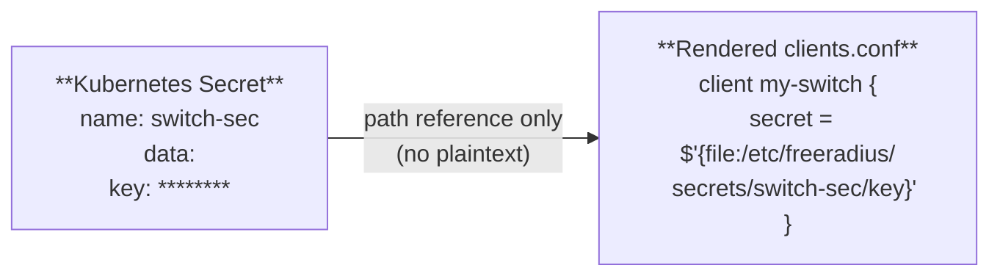

# Security
{: .no_toc }

How the operator handles secrets, and best practices for hardening your deployment.
{: .fs-6 .fw-300 }

## Table of contents
{: .no_toc .text-delta }

1. TOC
{:toc}

---

## Secret Handling Model

The operator enforces a strict principle: **plaintext secret values never appear in ConfigMaps, CRD specs, or operator logs.**

### How it works

1. You store sensitive values (shared secrets, database passwords, TLS keys) in Kubernetes Secrets
2. CRD specs reference those Secrets via `SecretRef` (name + key)
3. The operator mounts each referenced Secret as a **read-only volume** in the FreeRADIUS pod
4. Rendered configuration files use FreeRADIUS's `${file:...}` syntax to read the value from disk at runtime



The plaintext value exists only:
- In the Kubernetes Secret (etcd, encrypted at rest if configured)
- In the mounted file within the pod (tmpfs, never written to disk)
- In FreeRADIUS process memory

It does **not** exist in:
- The ConfigMap
- Operator logs
- CRD `.spec` or `.status` fields
- Kubernetes Events

### What gets mounted

Each unique Secret referenced by a `RadiusCluster`, its `RadiusClient` resources, or its modules gets its own volume mount:

```
/etc/freeradius/secrets/
├── switch-secret/
│   └── shared-secret       ← from RadiusClient secretRef
├── db-credentials/
│   └── password             ← from SQL module credentialsRef
├── ldap-credentials/
│   └── password             ← from LDAP module credentialsRef
└── eap-tls-cert/
    ├── tls.crt              ← from EAP module certRef
    └── tls.key              ← from EAP module keyRef
```

All Secret volumes are mounted with `readOnly: true`.

## Pod Security

### Container defaults

The operator generates pods with security-conscious defaults:

| Setting | Value | Purpose |
|:--------|:------|:--------|
| User | `65532:65532` (nonroot) | No root process in the container |
| Base image | `gcr.io/distroless/static:nonroot` | No shell, no package manager — minimal attack surface |
| Secret volumes | `readOnly: true` | Prevents accidental writes to secret files |

### Recommended Pod Security Standards

Apply the Kubernetes [Pod Security Standards](https://kubernetes.io/docs/concepts/security/pod-security-standards/) at the namespace level:

```bash
kubectl label namespace radius \
  pod-security.kubernetes.io/enforce=restricted \
  pod-security.kubernetes.io/warn=restricted
```

## Network Security

### Restrict RADIUS traffic

RADIUS uses UDP, which is unauthenticated at the transport layer. Use Kubernetes `NetworkPolicy` to limit which pods and external IPs can reach the RADIUS service:

```yaml
apiVersion: networking.k8s.io/v1
kind: NetworkPolicy
metadata:
  name: radius-ingress
  namespace: radius
spec:
  podSelector:
    matchLabels:
      app.kubernetes.io/name: production
  policyTypes:
    - Ingress
  ingress:
    - ports:
        - port: 1812
          protocol: UDP
        - port: 1813
          protocol: UDP
      from:
        # Only allow traffic from known NAS subnets
        - ipBlock:
            cidr: 10.0.0.0/8
        - ipBlock:
            cidr: 172.16.0.0/12
```

### Use TLS (RadSec)

For environments where RADIUS traffic crosses untrusted networks, enable [TLS](/freeradius-k8s-operator/guides/tls/) to encrypt all RADIUS communication.

## RBAC Best Practices

### Operator permissions

The operator needs broad permissions to manage resources. Review the ClusterRole in `config/rbac/role.yaml` and scope it appropriately:

- The operator **reads** Secrets and Pods (never writes to them)
- The operator **manages** Deployments, Services, ConfigMaps, and HPAs
- The operator **creates** Events

### User access

Limit who can create and modify RADIUS CRDs. Only network/platform engineers should be able to:

```yaml
apiVersion: rbac.authorization.k8s.io/v1
kind: Role
metadata:
  name: radius-admin
  namespace: radius
rules:
  - apiGroups: ["radius.operator.io"]
    resources: ["radiusclusters", "radiusclients", "radiuspolicies"]
    verbs: ["get", "list", "watch", "create", "update", "patch", "delete"]
  - apiGroups: [""]
    resources: ["secrets"]
    verbs: ["create", "get", "list"]
```

{: .warning }
> Anyone who can create a `RadiusClient` with a `secretRef` can cause the operator to mount and read any Secret in the namespace. Treat `RadiusClient` create/update permissions as equivalent to Secret read access.

## Secrets at Rest

Kubernetes Secrets are base64-encoded by default, not encrypted. For production deployments:

1. **Enable encryption at rest** in your Kubernetes cluster ([docs](https://kubernetes.io/docs/tasks/administer-cluster/encrypt-data/))
2. **Use an external secrets manager** like [External Secrets Operator](https://external-secrets.io/) to sync secrets from Vault, AWS Secrets Manager, or GCP Secret Manager
3. **Rotate secrets regularly** — update the Kubernetes Secret and the operator will trigger a rolling update to pick up the new value

## Checklist

- [ ] All sensitive values stored in Kubernetes Secrets (never hardcoded in YAML)
- [ ] Encryption at rest enabled for etcd
- [ ] `NetworkPolicy` restricting RADIUS ingress to known NAS subnets
- [ ] Pod Security Standards enforced at namespace level
- [ ] RBAC scoped — only authorized users can create/modify RADIUS CRDs
- [ ] TLS enabled for RADIUS traffic crossing untrusted networks
- [ ] Secret rotation process documented and tested
- [ ] Operator container image pulled from a trusted registry
